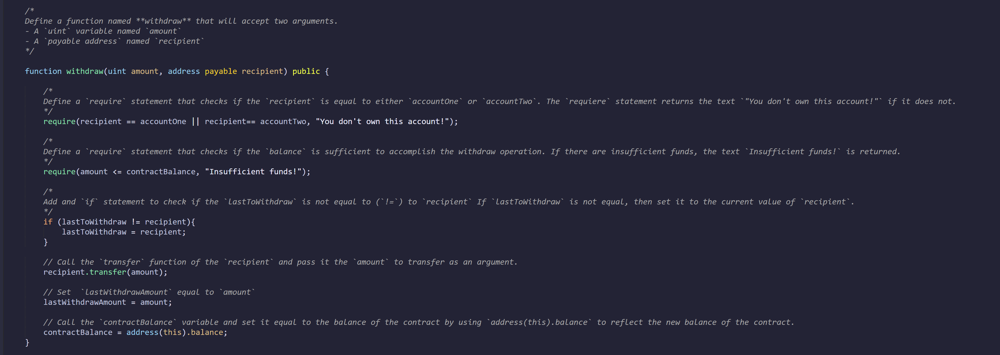
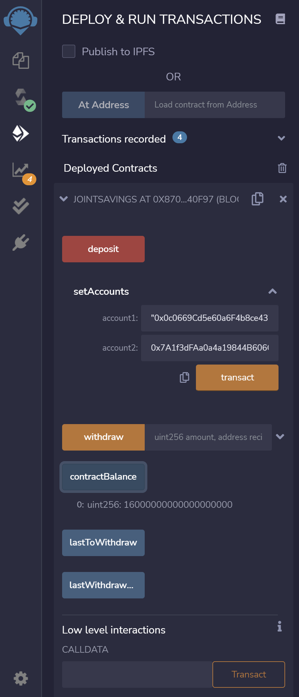

# Module-20-asgmt
## Joint Saving Accounts - Solidity

In this Joint_saving.sol file we will see how to automate a joint saving accounts.
First we create or define all the variables as shown in the image below

Define a function named Withdraw with a require statements that checks or confirm if the recipient is valid or not, and if there is a sufficient ballance to execute the transaction. Also defined contract balance, last withdraw amount and last to withdraw variables in this function.

The Dposit funtion that holds contract balance variable is defined as follows.

Defined another Set Accounts function to take the two adresses to create the joint accounts.

Finally defined the fallback function to be executed when the functions above does not match any of the available functions in a smart contract or if there was no data supplied at all.

* As  result after we complete the code we will compile and deploy the contract. All transactions excuted as shown below in this Excution Result section.

The green dot with the checkmarc indicates that compiled without error. And we have to check if we are in the right environment, correct network, account address, and if we are working on the right contract.

Once we confirm all the information is right after compilation we proceed to deploy the contract.

Then we set the joint accounts by providing the account addresses for Account one and Account two.

To test the functionality of the contract we will check the contract balance amount after we send ether of different amount in separate transactions. This time we use deposit function to send

Transaction 1: Sending 1 ether

Transaction 2: Sending 10 ether

Transaction 3: Sending 5 ether

After we deposited funds successfully, we test the functionality of the contract's withdrawal by verifying the amount in the contract balance, the last to withdraw and the last withdraw amount.

Transaction 1: Withdraw 5 ether

Transaction 2: Withdraw 10 ether

